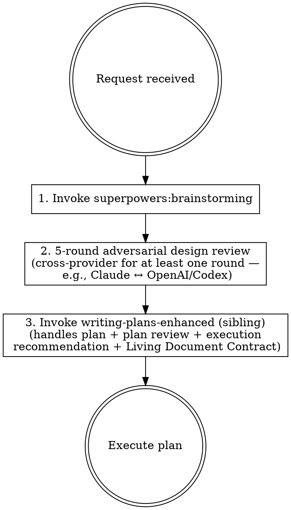

# Build Robust Features

## Terminology

The key words "MUST", "MUST NOT", "REQUIRED", "SHALL", "SHALL NOT", "SHOULD", "SHOULD NOT", "RECOMMENDED", "NOT RECOMMENDED", "MAY", and "OPTIONAL" in this document are to be interpreted as described in BCP 14 [RFC 2119] [RFC 8174] when, and only when, they appear in all capitals, as shown here.

## Overview

End-to-end workflow for turning a feature request, bug fix, or project to-do into a subagent-ready implementation plan. Chains brainstorming, adversarial design review, and disciplined planning to prevent the most common subagent failure modes: ambiguity, context gaps, and interpretation drift.

This skill owns the **upstream** half of the workflow: deciding *what* to build and stress-testing the design. The downstream half — turning the design into a subagent-proof plan, reviewing it adversarially, and recommending an execution strategy — is delegated to [`writing-plans-enhanced`](../writing-plans-enhanced/SKILL.md), which in turn delegates plan review to [`plan-review-cycle`](../plan-review-cycle/SKILL.md). The runner MUST NOT re-implement that downstream discipline here — see §What this skill does NOT do (and why) for the reasoning.

## When to Use

- Building a new feature or enhancement
- Fixing bugs that require planned implementation
- Any work that will be delegated to subagents via `superpowers:subagent-driven-development` or `superpowers:executing-plans`
- When the user says "build", "implement", "add", "fix" for non-trivial work

**When NOT to use:**

- Quick one-line fixes
- Exploratory research or investigation
- Work you'll do entirely yourself in this session
- Plan-writing for work whose design has already been settled (skip straight to `writing-plans-enhanced`)

## Workflow

### Step 1: Brainstorm

The runner MUST invoke the `superpowers:brainstorming` skill for the requested work. The output is a shared understanding of the user's intent, the requirements, and the design space — not yet a plan.

### Step 2: Adversarial Design Review

The runner MUST run a **5-round adversarial agent review of the design** that came out of brainstorming. The review challenges assumptions, finds gaps, and stress-tests the design **before any plan is written**. Each round SHOULD pick a different lens — e.g., "what fails under load", "what fails on partial input", "what fails when a dependency changes its contract", "what's the simplest version that still satisfies the requirements", "what would a malicious user do" — so the rounds are non-redundant.

**At least one round MUST use the leading model from a different provider** than the one running this skill — typically the pairing is **Claude ↔ OpenAI/Codex**, but any two leading models from distinct providers qualify. Models from the same provider share training-data biases and blind spots, so an all-same-provider review collapses into a single perspective talking to itself, which defeats the entire point of adversarial review. Cross-provider review is the *primary* mechanism that makes this step worth doing — it is REQUIRED, not a nice-to-have.

**How to dispatch cross-provider.** The mechanism depends on the runner's environment. In Claude Code, common primitives include: a sibling skill that wraps an external CLI (e.g., a `codex` skill that shells out to OpenAI's Codex CLI, or an equivalent for other providers), the Codex CLI invoked directly via Bash, or — when no native primitive exists — asking the user to copy the design into another provider's interface and paste the review back. The runner MUST use whatever cross-provider primitive the environment offers. If no such primitive exists and the user can't be reached for instructions, the same-provider fallback below applies.

**Same-provider fallback (use sparingly).** If — and only if — another provider's model is completely unavailable AND the user is unable to provide instructions for accessing one, the runner MAY dispatch a subagent from the same provider as the runner for the cross-provider round. In that case:

- The subagent MUST use the most capable available model at the highest reasoning effort the provider offers ("x-high", "high", or the equivalent — e.g., the latest Claude Opus at extended thinking, or GPT-5 / o-series at the highest reasoning effort).
- The runner MUST surface a one-line note to the user explaining that the cross-provider round was skipped, why, and which same-provider model + effort level was used in its place.

This is a degraded mode, not the default: a same-provider review at maximum effort still has correlated blind spots that a cross-provider review wouldn't.

This step is the unique value of `build-robust-features` over jumping straight to `writing-plans-enhanced`. Skipping it pushes design failures into the plan, where they cost more to find and fix. Skipping the cross-provider round specifically pushes a *single provider's blind spots* into the plan — even worse, because they look like consensus.

### Step 3: Write the Plan

The runner MUST invoke the sibling [`writing-plans-enhanced`](../writing-plans-enhanced/SKILL.md) skill with the brainstormed-and-reviewed design as input, and MUST NOT invoke `superpowers:writing-plans` directly. `writing-plans-enhanced` is the right entry point because it layers in the subagent-proofing requirements, TDD mandates, pitfalls reviews, the **Living Document Contract**, the execution strategy recommendation, and (at its Step 4) the multi-round plan review cycle via the sibling [`plan-review-cycle`](../plan-review-cycle/SKILL.md). All three skills are siblings in this plugin — always present when this skill is.

### What this skill does NOT do (and why)

The previous version of this skill restated the subagent-proofing requirements (eliminate ambiguity / prevent context gaps / prevent interpretation drift / mandate TDD / check pitfalls / minimize cross-task conflicts) and an inline plan-review cycle. Those have moved entirely into `writing-plans-enhanced` and `plan-review-cycle`. Having them in one place — owned by the plan-writing skill, not duplicated here — means:

- The discipline can evolve without two skills drifting out of sync.
- Users who skip brainstorming and call `writing-plans-enhanced` directly still get the same subagent-proofing.
- This skill stays focused on its real contribution: brainstorm + adversarial design review.

Future maintainers: subagent-proofing rules belong in `writing-plans-enhanced`, not here. This skill's body SHOULD remain focused on brainstorming and adversarial design review; if you find yourself wanting to add subagent-proofing requirements, add them to `writing-plans-enhanced` instead so they apply to every entry path (this skill, direct invocations, `bug-hunt-cycle` Phase 6, `health-review-cycle` Phase 4).

## Common Mistakes

- **Skipping the brainstorm** because "the user already explained what they want" — brainstorming surfaces requirements the user didn't think to articulate.
- **Skipping adversarial review** because "the brainstorm was thorough" — review catches a different class of problems (failure modes, hidden assumptions, contract drift).
- **Running all 5 adversarial review rounds against the same provider** — provider independence is the load-bearing primitive here. Same-provider models share training-data biases, so 5 rounds against your own provider collapses into one perspective talking to itself. The cross-provider round (Step 2) is REQUIRED, not optional — and the same-provider fallback only applies when another provider is genuinely unreachable AND the user can't help bridge to one.
- **Calling `superpowers:writing-plans` directly** — bypasses subagent-proofing, the Living Document Contract, and the plan-review cycle. Use the sibling `writing-plans-enhanced` skill.
- **Re-implementing plan review here** — `writing-plans-enhanced` already runs `plan-review-cycle` at its Step 4. Adding another inline review cycle here is duplication that drifts out of sync.
- **Treating the adversarial review as design *iteration* rather than design *audit*** — the review surfaces issues; you decide which to fold back into the design before invoking `writing-plans-enhanced`. Don't merge them into a single endless loop.
